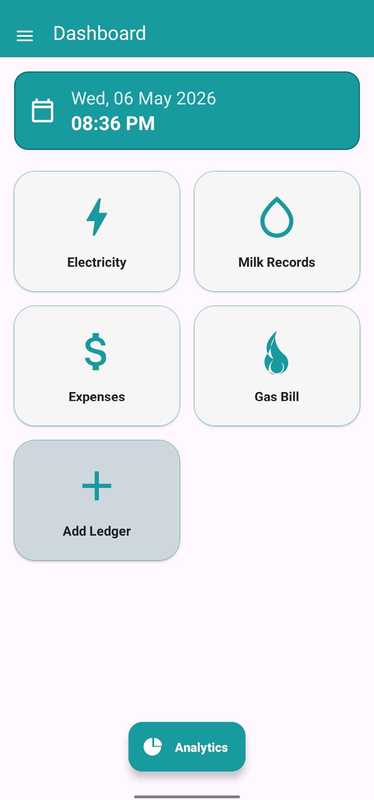
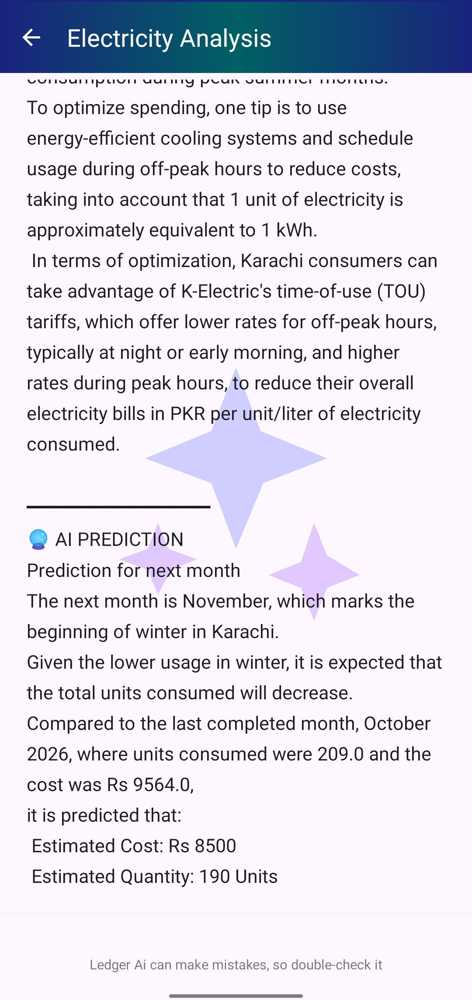
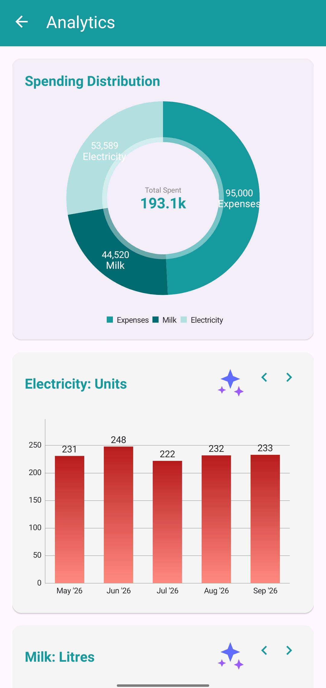
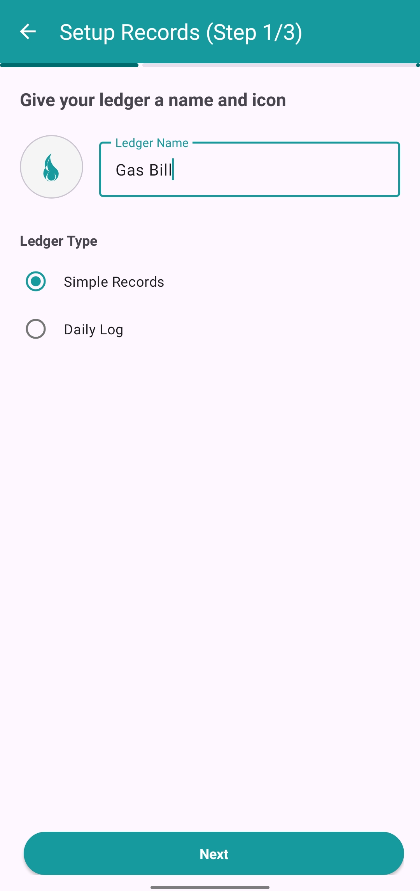
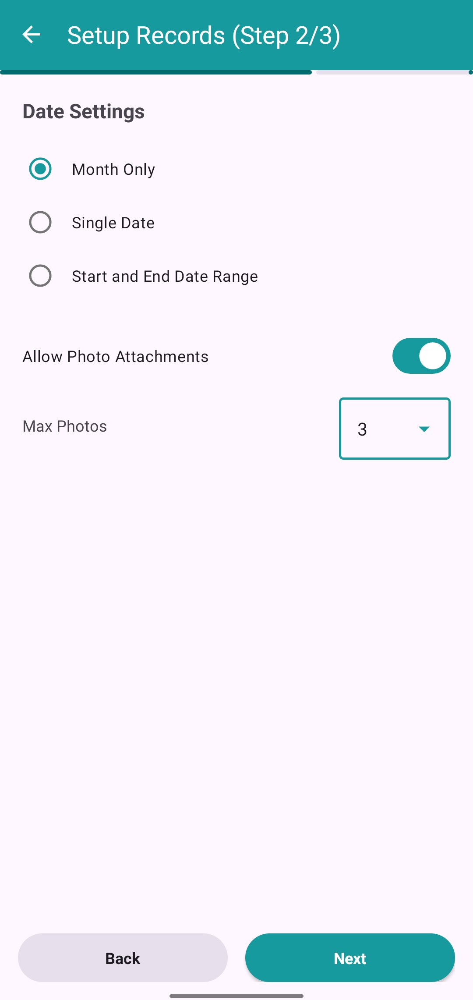
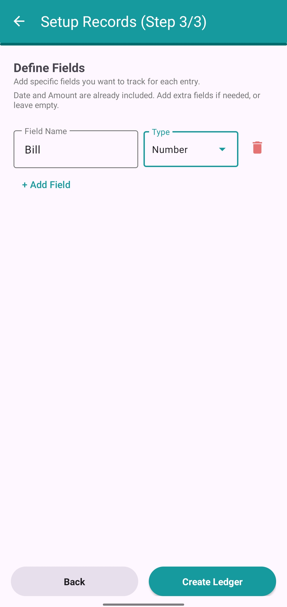
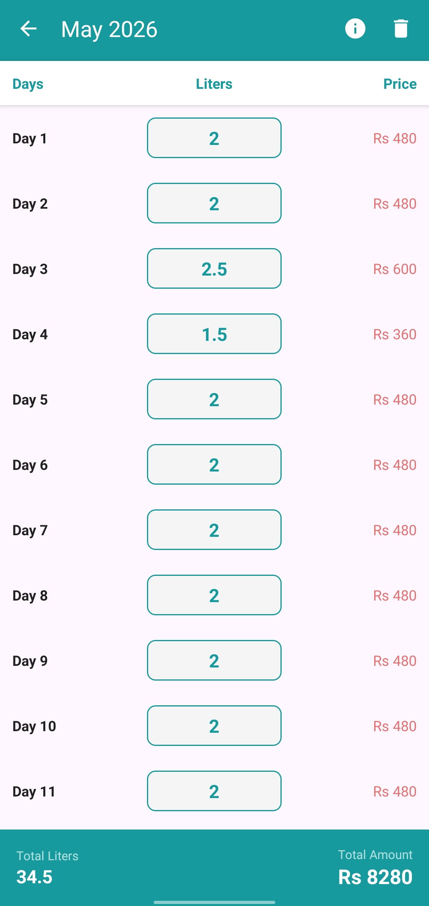
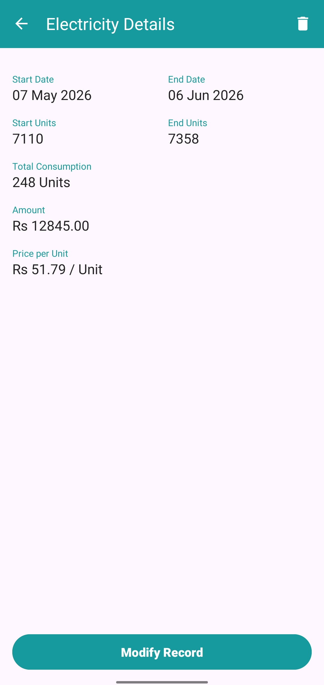
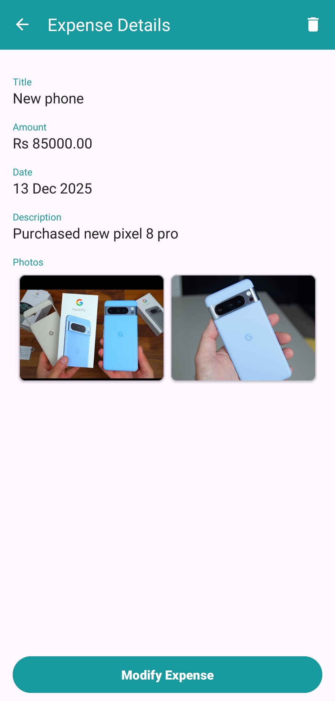
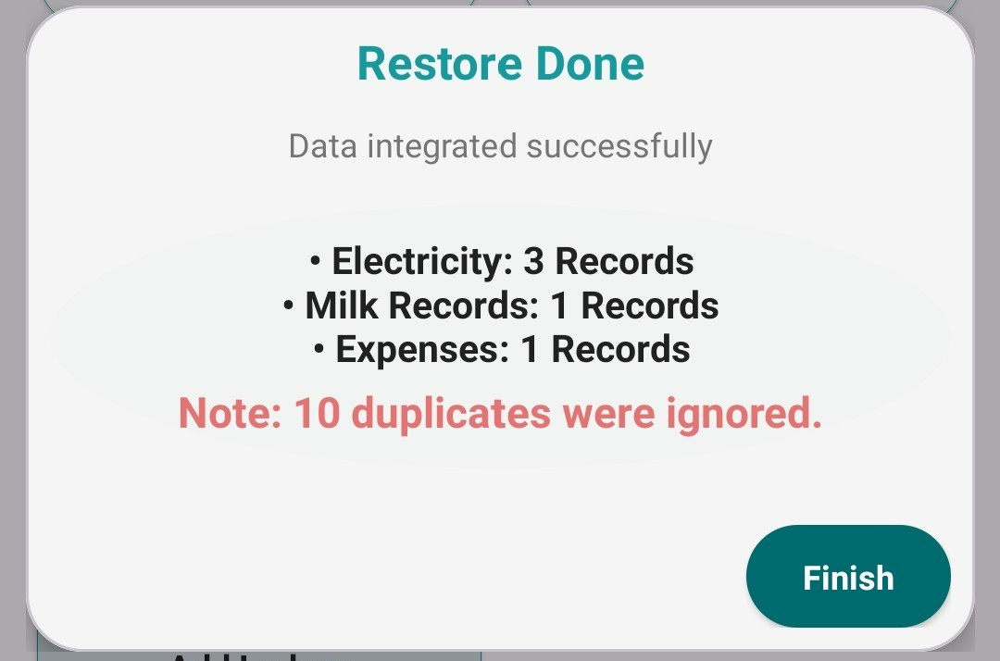

# 📌 SmartLedger - AI-Powered Finance & Ledger Management

**SmartLedger** is a feature-rich Android application designed for seamless finance management and ledger tracking. By combining dynamic record-keeping with powerful AI integrations, SmartLedger empowers users to meticulously track expenses, manage daily logs, and gain actionable financial insights. 

Whether you are logging utility bills, everyday expenses, or managing a custom budget, SmartLedger makes personal finance intelligent, intuitive, and highly secure.

---

## 📖 Overview

SmartLedger revolutionizes traditional expense tracking by moving beyond simple data entry. It serves as a comprehensive financial assistant that not only stores your daily, monthly, or periodic records but also visualizes spending trends. With built-in AI analytics powered by Groq, the app analyzes your habits to provide smart forecasts and optimization tips, ensuring you stay in control of your financial goals.

---

## ✨ Key Features

- **📊 Dynamic Ledger Management:** Create highly customized ledgers tailored to your needs. Support for Single Date, Month-Only, and Start/End Date ranges.
- **📝 Comprehensive Expense Tracking:** Manage daily logs effortlessly. Add titles, amounts, descriptions, and attach up to multiple receipt photos for accurate record-keeping.
- **🔔 Smart Notification System:** Intelligent reminders for daily logs (like milk records). It prompts users to log their data via rich notifications (with direct input and quick-reply actions) and includes a fallback mechanism that automatically sends a reminder at midnight if the user missed their daily entry.
- **🤖 AI-Powered Financial Assistant:** Integrates with Groq API to analyze your data, offering spending predictions and personalized optimization tips.
- **📈 Advanced Analytics & Visualization:** Interactive, beautiful charts providing a visual breakdown of your financial distribution across all ledgers.
- **☁️ Smart Backup & Restore:** Secure your data with robust Local and Google Drive backup options. Features an intelligent restore mechanism that automatically detects and ignores duplicate records to prevent data redundancy.
- **🗑️ Safe Deletion (Trash Bin):** An automated safety net that holds deleted records and automatically purges them after 15 days, preventing accidental data loss while optimizing storage.
- **🎨 Modern & Responsive UI/UX:** Built with Material Design principles, providing a clean, accessible, and engaging user experience.

---

## 🧠 AI Features & Insights

SmartLedger leverages the **Groq API** to provide intelligent financial foresight:
- **Spending Predictions:** The AI analyzes historical data to forecast future estimated costs and quantities (e.g., utility consumption for the upcoming winter).
- **Optimization Tips:** Generates practical, context-aware suggestions (such as utilizing off-peak electricity tariffs) to help users reduce their overall expenditure.
- **Data-Driven Insights:** Helps users identify irregular spending patterns by evaluating past completed months against current trends.

---

## 🛠 Tech Stack

SmartLedger is built using modern Android development practices and libraries:

- **Language:** Kotlin
- **UI Toolkit:** XML & Material Design 3
- **Local Database:** Room Database (with KSP)
- **Networking:** Retrofit2 & Gson
- **Asynchronous Programming:** Kotlin Coroutines & Flow
- **Background Processing:** WorkManager (for auto-deleting trash)
- **Data Visualization:** MPAndroidChart
- **Image Handling:** Glide (loading) & PhotoView (interactive full-screen viewing)

---

## 🏛 Architecture

The application follows a **modular layered architecture inspired by Clean Architecture principles**, with separation between UI, data, and networking layers.

- **UI Layer:** Consists of `Activities` and custom `Adapters` responsible for rendering the interface and handling user interactions. 
- **Repository/Data Layer:** Acts as a single source of truth. It abstracts the underlying data sources, managing local data persistence using **Room Database**.
- **Networking Layer:** Configured using **Retrofit** to securely and efficiently communicate with external services (Groq API) for AI functionalities.
- **Security:** API keys are injected securely at compile time via `local.properties` and `BuildConfig`, preventing exposure in the source code.

---

## 📸 Screenshots

Below are key screens from the SmartLedger app showing core functionality, AI insights, and user workflows.

### 🏠 Dashboard

> Main home screen of the app showing all active ledgers, current date, and quick navigation options.

### 🧠 AI Insights & Predictions

> Displays AI-generated financial insights and predictions, helping users understand spending patterns and future estimates based on historical data.

### 📊 Analytics Dashboard

> Visual representation of expenses and income, offering interactive graph-based breakdowns for better financial tracking.

### 🧾 Create New Ledger (Step 1)

> Initial setup screen for creating a new custom ledger, allowing the user to select appropriate names and icons.

### 🧾 Create New Ledger (Step 2)

> Adds detailed configurations for ledger categories, preparing the structure for precise expense tracking (e.g., setting photo limits and date types).

### 🧾 Create New Ledger (Step 3)

> Final step where users can define custom dynamic fields (like amounts or quantities) before ledger creation.


### 📝 Daily Log Management

> Used to manage daily financial entries, supporting rapid addition, editing, and organization of logs.

### ⚡ Electricity Bill View

> Dedicated view for tracking electricity expenses, helping users analyze utility consumption and pricing separately.

### 💰 Expense View Screen

> Displays a detailed breakdown of an individual expense, including descriptions and attached receipt photos.

### 🔄 Restore Confirmation Dialog

> Custom dialog shown after restoring data. Highlights the smart restore logic that safely ignores duplicate entries to maintain data integrity.
---

## ⚙️ Installation Steps

Follow these steps to run SmartLedger locally:

1. **Clone the Repository:**
   ```bash
   git clone https://github.com/mudasirunar/SmartLedger.git
   ```
2. **Open in Android Studio:**
   Launch Android Studio and select `Open an existing project`, then navigate to the cloned directory.
3. **Configure API Key (Crucial Step):**
   This app uses the Groq API for AI features. To enable this, create a `local.properties` file in the root directory of the project and add your API key:
   ```properties
   GROQ_API_KEY="YOUR_GROQ_API_KEY_HERE"
   ```
4. **Sync Project:**
   Click on `Sync Project with Gradle Files` to download all necessary dependencies.
5. **Run the App:**
   Select your emulator or physical device and hit `Run` (Shift + F10).

---

## 🔐 Permissions & Security Notes

- **Internet Permission:** Required to communicate with the Groq API for AI predictions and for Google Drive backup synchronization.
- **Storage/Media Permissions:** Required to save/load photo attachments for expenses and to perform local database backups.
- **API Key Security:** The `local.properties` file is included in `.gitignore` by default to ensure API keys are never accidentally committed to public version control.

---

## 🚀 Future Improvements

- **☁️ Cloud Sync & Real-Time Database:** Transition to Firebase or a remote REST API to allow real-time multi-device synchronization.
- **💬 Conversational AI:** Integrate an AI Chatbot interface allowing users to query their financial data using natural language (e.g., "How much did I spend on groceries last week?").
- **📈 Advanced Charting:** Introduce line graphs for comparative yearly analysis and custom date-range filtering in the Analytics dashboard.
- **👥 Multi-User Shared Ledgers:** Enable collaborative ledgers so families or small teams can manage a shared budget effortlessly.
- **🌍 Localization:** Expand language support to cater to a global user base.
